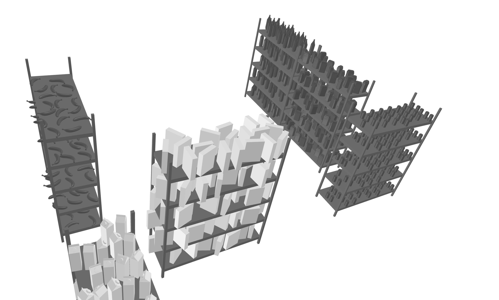

# Darkstore Synthesizer v.0

## Описание  
**Darkstore Synthesizer** – это проект по симулированию и автоматизации работы даркстора. Основан на использовании библиотек [ManiSkill](https://github.com/haosulab/ManiSkill) и [scene_synthesizer](https://github.com/NVlabs/scene_synthesizer).

## Как генерировать сцены в scene_synthesizer
```dsynth/ss_scene/store.py``` - скрипт, который по ```input.json``` 
генерирует сцену ```myscene_<first_size>_<second_size>.json```

**Более детально:**

Запуск ```python store.py --input <путь_до_inputJSON> --show```,

Также можно ```python store.py```, тогда ```--input``` по умолчанию установиться ```models/input.json```.

При добавлении этого флага ```--show``` при запуске программы будет сгенерированна ещё и 3D-визуализация

**Что должно быть в вашем ```input.json```?**

```room_size``` - ```[first_size, second_size]```

```door_coords``` - координаты входа в склад в ноль-индексации ```[x, y]```

```blocked_matrix``` - матрица из 0 и 1, где 0 - свободные клетки склада и 1 - заблокированные (```list[list[int]]```)

```random_shelfs``` - матрицы ```BOARDSx<количество_продуктов_на_полке>```,
где ```BOARDS``` - это константа объявленная в ```scripts/store.py```, количество матриц должно совпадать с жеелаемым 
желаемым количеством стелажей (```list[list[list[str]]]```)

Для генерации своего ```input.json``` можно использовать ```dsynth/ss_scene/generate_json_to_input.py```

## Что готово уже сейчас?
За кадром проведено очень много работы. Вот те вещи, которые можно пощупать:
- 🔹 Использование кучи рабочих моделек;
- 🔹 Генерация хороших сцен в scene_synthesizer;
- 🔹 Экспорт сцены в JSON, после парсинга экспортирование их в ManiSkill;
- 🔹 Симуляция в 3D настоящий даркстор;
- 🔹 Обертки для environment’ов;
- 🔹 Motion planning: взаимодействие робота с окружением в дарксторе;
- 🔹 Octo features и многое другое.

## Установка  
Для работы с проектом необходимо установить [ManiSkill](https://github.com/haosulab/ManiSkill), [scene_synthesizer](https://github.com/NVlabs/scene_synthesizer), а также некоторые промежуточные библиотеки.

## Структура проекта
```
darkstore_synthesizer/
│── dsynth/          # Основной пакет проекта
│── models/          # Модели для симуляции среды
│── scripts/         # Скрипты для генерации среды
│── sandbox/         # Рабочие папки
│── gallery/         # Галерея
│── scenes/          # Сцены для экспорта в ManiSkill
│── README.md        # Описание проекта
```

## Галерея
Все изображения и видео можно найти в папке [«Галерея»](https://github.com/SoshinK/darkstore_synthesizer/tree/main/gallery).




## Авторы  
- **Михаил Любин**
- **Тимур Габбасов**  
- **Андрей Грицаев**
- **Артем Багринцев**
- **Динар Якупов**
- **Константин Сошин**
