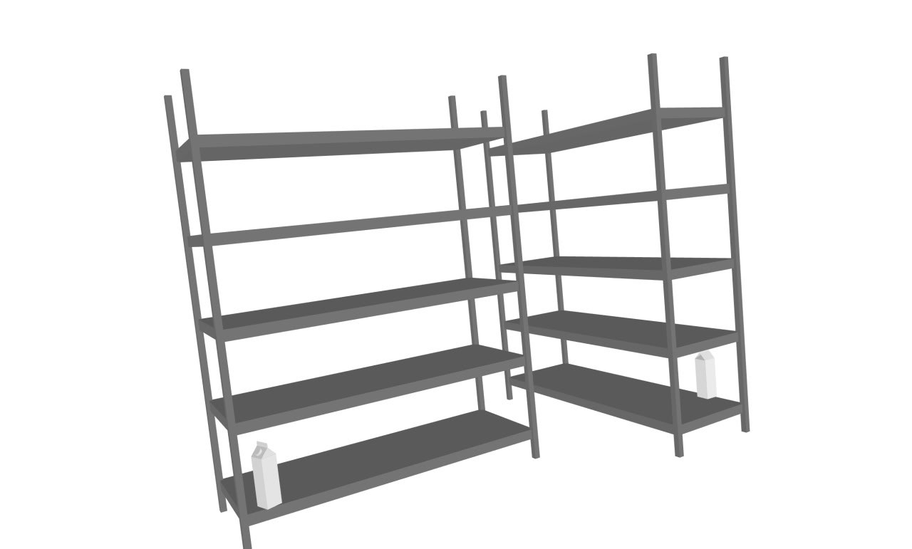
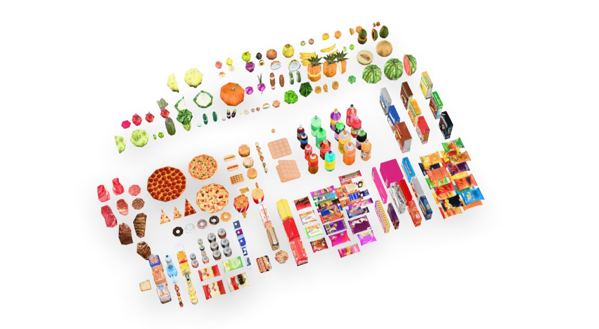
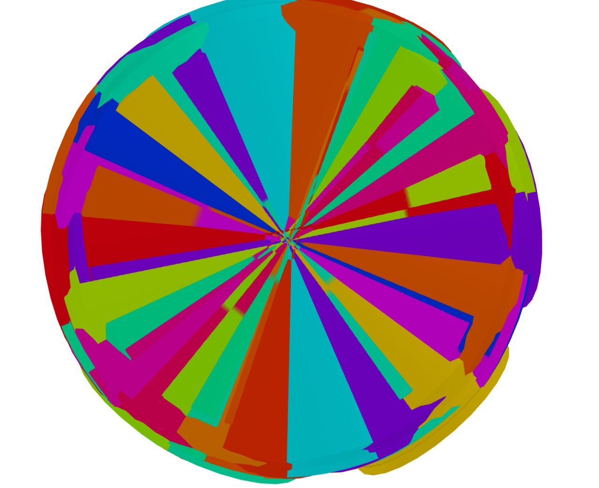

# Darkstore Synthesizer v.0

## Описание  
**Darkstore Synthesizer** – это проект по симулированию и автоматизации работы даркстора. Основан на использовании библиотек ManiSkill и scene_synthesizer.

## Что готово уже сейчас?
За кадром проведено очень много работы. Вот те вещи, которые можно пощупать:
- 🔹 Генерация хороших сцен в scene_synthesizer;
- 🔹 Использует кучу рабочих моделек;
- 🔹 Экспортирует сцены в JSON, после парсинга экспортирует их в ManiSkill;
- 🔹 Симулирует в 3D настоящий даркстор и многое другое.

## Что будет готово потом?
...
...
...

## Установка  
Для работы с проектом необходимо установить ManiSkill, scene_synthesizer, а также некоторые промежуточные библиотеки.

## Структура проекта  (раздел не готов)
<!-- ```
darkstore_synthesizer/
│── models/          # Модели для синтеза данных
│── scripts/         # Скрипты для генерации данных
│── sandbox/         # Черновые эксперименты и тесты
│── check.py         # Валидация данных
│── gen.py           # Генерация данных
│── README.md        # Описание проекта
``` -->

## Галерея
Все изображения и видео можно найти в папке gallery/.




## Авторы  
- **Михаил Любин**
- **Тимур Габбасов**  
- **Андрей Грицаев**
- **Артем Багринцев**
- **Динар Якупов**
- **Константин Витальевич**